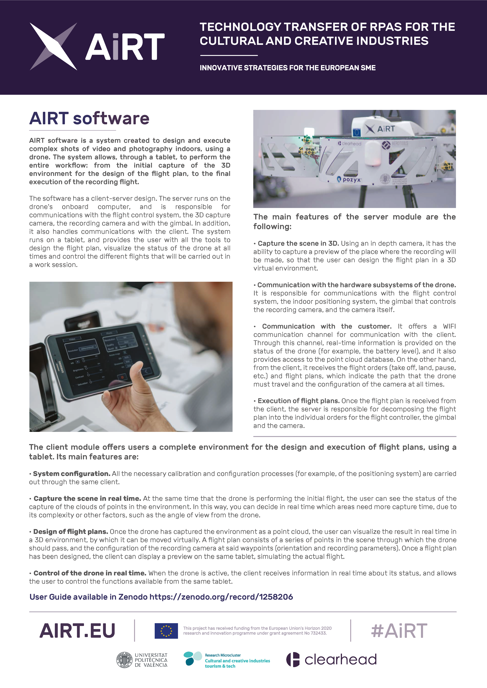

# AIRT software

AIRT software is a system created to design and execute complex shots of video and photography indoors, using a drone. The system allows, through a tablet, to perform the entire workflow: from the initial capture of the 3D environment for the design of the flight plan, to the final execution of the recording flight.

The software has a client-server design. The server (OCS) runs on the drone's onboard computer, and is responsible for communications with the flight control system, the 3D capture camera, the recording camera and with the gimbal. In addition,
it also handles communications with the client (GCS). The client runs on a tablet, and provides the user with all the tools to
design the flight plan, visualize the status of the drone at all times and control the different flights that will be carried out in a work session.

The main features of the server module are the
following:
* Capture the scene in 3D. Using an in depth camera, it has the ability to capture a preview of the place where the recording will be made, so that the user can design the flight plan in a 3D virtual environment.
* Communication with the hardware subsystems of the drone. It is responsible for communications with the flight control
system, the indoor positioning system, the gimbal that controls the recording camera, and the camera itself.
* Communication with the customer. It offers a WIFI communication channel for communication with the client. Through this channel, real-time information is provided on the status of the drone (for example, the battery level), and it also provides access to the point cloud database. On the other hand, from the client, it receives the flight orders (take off, land, pause,
etc.) and flight plans, which indicate the path that the drone must travel and the configuration of the camera at all times.
* Execution of flight plans. Once the flight plan is received from the client, the server is responsible for decomposing the flight plan into the individual orders for the flight controller, the gimbal and the camera.

User Guide available in Zenodo https://zenodo.org/record/1258206

This project has received funding from the European Union's Horizon 2020 research and innovation programme under grant agreement No 732433.

